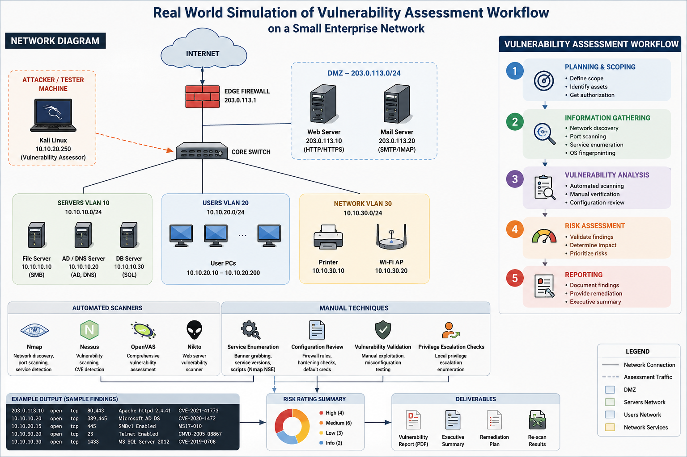

# SECURITY-OPERATION - CENTER (SOC Projrcts and labs)
## Security Operations Center labs, SIEM engineering, detection engineering, and threat hunting projects.

------------------------------------------------------------------------------------------------------------------------------------------------------------------------------------------------------------------
# 1) Cloud-Native EDR: Automated Threat Response with Microsoft Sentinel
 

This diagram illustrates the seamless flow from endpoint telemetry to threat detection and automated remediation. It highlights key components such as:
- Endpoints: Devices generating telemetry and behavioral data
- Defender for Endpoint: Providing deep threat intelligence and protection
- Microsoft Sentinel: Centralizing logs, alerts, and orchestrating response
- KQL Rules & Playbooks: Enabling customizable detection and automation
- Response Actions: Isolating compromised devices and mitigating threats

## Description 
This project showcases a cloud-native Endpoint Detection and Response (EDR) solution built on Microsoft Sentinel, designed to detect, investigate, and respond to threats in real time across distributed environments.
Leveraging Microsoft Defender for Endpoint, KQL-based analytics, and automated playbooks, this solution demonstrates how to build a scalable, intelligent, and responsive security operations framework in Azure.
## Key Features 

- Real-Time Threat Detection using custom and built-in Sentinel analytics rules
- Automated Incident Response via Logic Apps and Sentinel Playbooks
- Integration with Microsoft Defender for Endpoint for enriched telemetry
- Threat Hunting Workbooks for proactive investigation
- Scalable Architecture suitable for enterprise-grade deployments
## Technologies Used
- Microsoft Sentinel (SIEM + SOAR)
- Microsoft Defender for Endpoint
- Azure Logic Apps
- Kusto Query Language (KQL)
- Azure Monitor & Log Analytics
- PowerShell & Azure CLI (optional automation)
## Used Cases
- Detecting ransomware and lateral movement across endpoints
- Automating isolation of compromised devices
- Visualizing endpoint threat trends and anomalies
- Integrating threat intelligence feeds for enriched detection
  
---------------------------------------------------------------------------------------------------------------------------------------------------------------------------------------------------------------

# 2) Windows Event Monitoring Using Splunk in A Simulated SOC Lab

### SOC lab without Splunk, each component generate and keeps its logs

## Project Objectives
To simulate a basic SOC environment by collecting and monitoring system logs using Splunk ES, and creating arlets for potential security incidents( Brute force attempts, failed logins etc), create an vizualizse results on dashboards.
### SOC Labs with Splunk Forwarders ingesting logs to Splunk ES
 

### Tools Used
- Splunk ES (installed locally)
- Splunk Forwarders (Installed on VMs)
- Windows 10 VM with Sysmon installed
  ### Project Task and Steps
  ### A) Set up Splunk ES
  - Installed Splunk locally
  - Create a Splunk Admin account
  -  Enable port 8000 access
  ### B) Installed and configured Sysmon on windows
  - Used SwiftOnSecurity Sysmon cofiguration
  - Log key activities like process creation, network connection, file creation
  ### C)  Forward Logs to SplunK
  - Used Splunk Universal Forwarders to collect logs from VMs to Splunk ES
  - Index and Tag Log sources as Windows and Sysmon
  ### D) Create Dashboards
  ### E) Set Detection Alerts
  ### F) Simulate Attacks
  ### G) Document Your Findings

-------------------------------------------------------------------------------------------------------------------------------
# 3) Brute-Force-Detection-App-using-Python-Streamlit
## Screenshots 
## Before

## After : Checking if an IP has been Brute-Force

## Objective
Develop a user-friendly application that helps identify potential brute-force attacks by analyzing system logs for patterns of repeated failed login attempts, access anomalies, or suspicious user behavior.
## Problems Solved
•	Intrusion Detection: Flags excessive failed login attempts suggesting brute-force attempts

•	Real-time Monitoring: Enables tracking live logs or periodic scans for login abuse

•	User Behavior Analysis: Offers insights into login frequency, timing, and IP activity

•	Learning Platform: A safe space to explore brute-force detection concepts without engaging in malicious activities
## Tools & Technologies Used
|Tool	      | Role                                                        |
|-----------|-------------------------------------------------------------|
|Python 	  |Core backend scripting for data analysis                     |
|Streamlit  |Builds an intuitive and interactive front-end UI             |
|pandas:  	|Parses and analyzes log files efficiently                    |
|re (Regex) |Detects suspicious patterns like repeated failed attempts    |
|datetime 	|Tracks timestamps and calculates time-based anomalies        |
|socket 	  |Optionally resolves IP addresses and ports (for advanced use)|
## Features
•	Log File Upload: Accepts system-auth or custom logs for analysis

•	Alert System: Visual flags when brute-force patterns are detected

•	Stats Dashboard: Number of failed attempts, flagged IPs, peak attack times

•	IP Lookup (Optional): Resolve locations or blacklist common sources
## Sample Use Cases
•	Educational labs in cybersecurity classes

•	Internal tool for sysadmins to audit login security

•	Prototype module for larger SIEM systems

 -----------------------------------------------------------------------------------------------------------------------------------------------------------------
# 4) Phishing Detection using Python and Streamlit

## Discription 
This project presents a lightweight and powerful Phishing URL Detection Tool built with Python and Streamlit. The goal is to protect users from falling victim phishing attacks 
## Key Features
- URL Input and real time prediction
- Clean and simple web UI built with Streamlit
# Objectives
- Detect whether a URL is phishing or legitimate
- Build and easy to use web UI with Streamlit
- Educate users of common phishing indicators

--------------------------------------------------------------------------------------------------------------------------------------------------------------------

# 5) Keylogger-Detection
## Objective
Build an educational tool using Python and Streamlit that scans a computer system for signs of keylogger activity—focusing on suspicious files, processes, and startup entries. This app helps users understand basic security hygiene and malware detection principles in a safe, responsible learning context.
## Problems Solved
•	Identifying Suspicious Files: Detects common log files that may be dropped by keylogger tools (e.g. log.txt, keylog.txt).

•	Process Monitoring: Flags processes running with names associated with known keylogging software.

•	Startup Entry Scanning: Checks common startup paths for executables that may run silently on boot.

•	Educational Insights: Offers students hands-on exposure to threat detection without engaging in harmful practices.
## Tools & Technologies Used
### Tools
Python	Core scripting language

Streamlit	Interactive and intuitive GUI for real-time scanning

os	File system navigation and access

psutil	Process monitoring and metadata extraction

pathlib	Handling and navigating file paths (optional upgrade)
## Features
•	Click-to-scan interface for rapid deployment

•	Categorized output: Files, Processes, Startup Entrances

•	Color-coded alerts: Red (Detected), Green (Clean)

•	Easily customizable lists of known suspicious indicators

------------------------------------------------------------------------------------------------------------------------------------------------------------------------
# 6) Vulnerability-Lab
# SecureNet Vulnerability-Assessment
## Project Description
A real world simulation of vulnerability assessment workflow on a small enterprise network using a combination of automated scanners and manual techniques

## Tools and Technologies
- Nessus Essential  
- Nmap
- OpenVAS
- Kali Linux
- Ubuntu20.04
- Windows 10 
- Wireshark 
- Netcat
 ## Methodology 
 1. Assets Discovery: I scanned a network using Nmap to discover live host and services 
 2. Scanning: I perform vulnerability scanning using Nessus Essential and OpenVAS.
 3. Analysis: Validated finding and assessed risk using CVE CVSS
 4. Mitigation: Apply Patches, disabled vulnerability services, updated firewall rules.
 5. Reporting: I compiled executive and technical reports with screenshots and logs.
  
